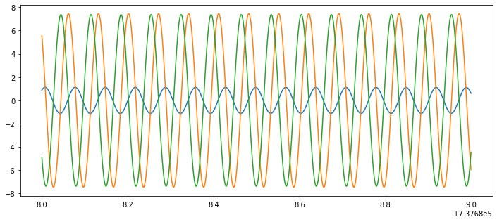

# Module 2: TLE and Understanding


```python
# importing required libraries 
import crsutil as crs
import tleplotlib as tlib
import numpy as np
import matplotlib.pyplot as plt

```

We will now read the resource.txt file from the NORAD two line elements. File download from celestrak in year 2018


```python
# tleplotlib.read() can take one or two input. 
# The first input is the name of the satellite while the second input is the source where the satellite should be read from. 
# If second input is not provided, then the satellite will be found for the latest uploaded file available at celestrak.com 
tle = tlib.read('RADARSAT-2', 'resource.txt')
```


```python
# Lets read the contents of the tle file we converted
print(tle)
```

    {'a0': 7169921.229206343,
     'arg_perigee': 1.5942814772097325,
     'bstar': 6.266e-05,
     'classification': 'U',
     'element_number': 999,
     'ephemeris_type': 0,
     'epoch': numpy.datetime64('2018-11-20T05:48:43.152768'),
     'epoch_day': 324.24216612,
     'epoch_year': '18',
     'excentricity': 0.00012059999999999999,
     'id_launch_number': '061',
     'id_launch_piece': 'A  ',
     'id_launch_year': '07',
     'inclination': 1.7205106700309702,
     'mean_anomaly': 5.671405516453526,
     'mean_motion': 89.84855262549613,
     'mean_motion_derivative': 1.18e-06,
     'mean_motion_sec_derivative': 0.0,
     'orbit': 57076,
     'right_ascension': 5.746332501241642,
     'satnumber': '32382'}
    

If interested in reading the latest file, we can write: 


```python
tle = tlib.read('RADARSAT-2')
```


```python
print(tle)
# Notice the change in epoch_year element
```

    {'a0': 7169921.058730804,
     'arg_perigee': 1.573456208574936,
     'bstar': 1.4319e-05,
     'classification': 'U',
     'element_number': 999,
     'ephemeris_type': 0,
     'epoch': numpy.datetime64('2019-11-22T00:52:06.175776'),
     'epoch_day': 326.03618259,
     'epoch_year': '19',
     'excentricity': 9.71e-05,
     'id_launch_number': '061',
     'id_launch_piece': 'A  ',
     'id_launch_year': '07',
     'inclination': 1.7204967073969544,
     'mean_anomaly': 0.0482950057319351,
     'mean_motion': 89.84855582992064,
     'mean_motion_derivative': -7e-08,
     'mean_motion_sec_derivative': 0.0,
     'orbit': 62318,
     'right_ascension': 5.771261038947878,
     'satnumber': '32382'}
    


```python
# Lets create a time vector
t = tlib.tledatenum(2019, 9, 20, 2019, 9, 21)
```


```python
# Lets create the tle into orbit and then to state vector to get vectorised position and velocity
# Finally we obtain the xsat and vsat
```


```python
xsat, vsat = tlib.tle2vec(tle, t)
```


```python
plt.figure(figsize=(12,5))
plt.plot(t, vsat[:,0]/1000)
plt.plot(t, vsat[:,1]/1000)
plt.plot(t, vsat[:,2]/1000)
```


    [<matplotlib.lines.Line2D at 0x2ab42907f88>]




